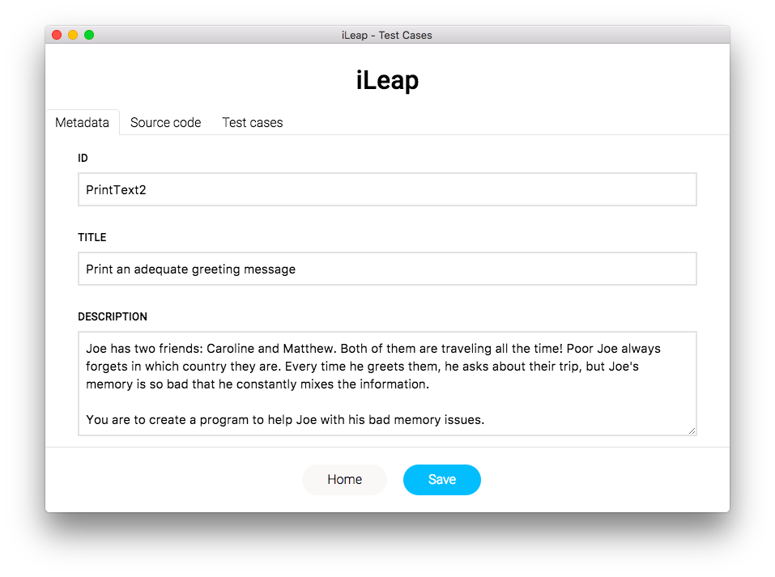
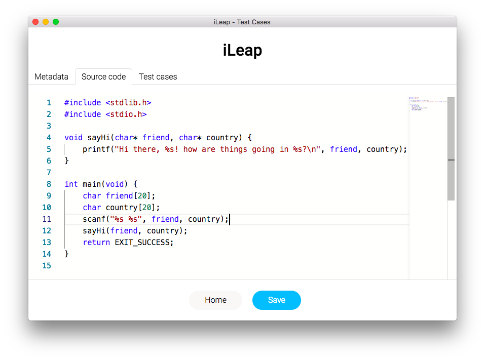
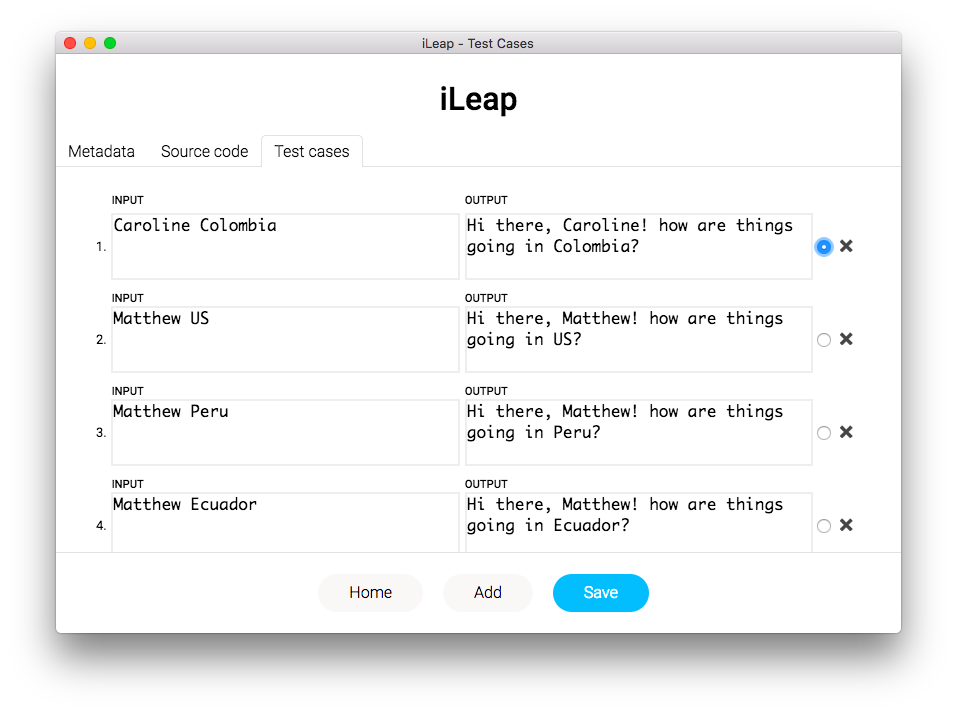

# iLeap Studio

## Screenshots

## Scripts

`yarn start` will start the Electron app and the React app at the same time.

`yarn build` will build the React app and package it along the Electron app.

`yarn release` will package the app (Mac, Windows, and Linux) and create a release on Github.
